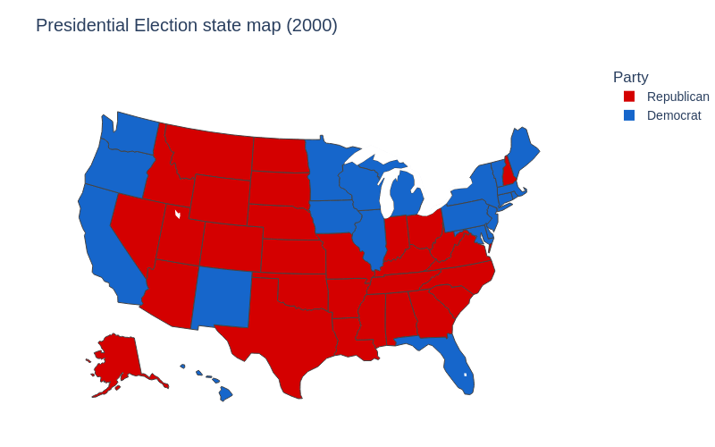
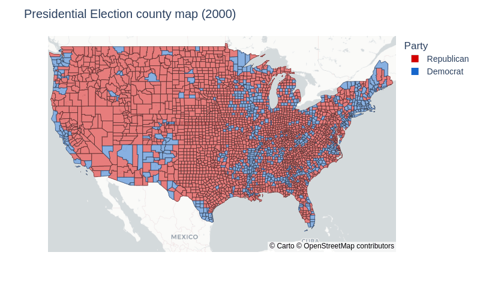

# Mapping the 2000-2020 Election Results

View the notebook: [election-results.ipynb](//github.com/christianmendoza/us-presidential-election-results/blob/main/election-results.ipynb)

Visualizing geographically at the state and county level the past six presidential election results.

Using [pandas](https://pandas.pydata.org/) to clean and wrangle, and [plotly.express](https://plotly.com/python/plotly-express/) to plot the geographics.

Dataset from:

- *MIT Election Data and Science Lab, 2018, "County Presidential Election Returns 2000-2020", [https://doi.org/10.7910/DVN/VOQCHQ](https://doi.org/10.7910/DVN/VOQCHQ), Harvard Dataverse, V11, UNF:6:HaZ8GWG8D2abLleXN3uEig== [fileUNF]*

